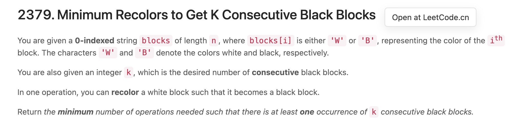

# LeetScript

Useful user scripts to improve LeetCode experience.

## Installation

You can install these scripts using [GreasyFork](https://greasyfork.org/en).

- Install [Open All Problems](https://greasyfork.org/en/scripts/449959-open-all-problems)
- Install [Open at LeetCode.cn](https://greasyfork.org/en/scripts/449968-leetcode-contest-open-at-leetcode-cn)

## Open All Problems

Add an `Open All Problems` button on the LeetCode Contest page. Note that Pop-up windows need to be allowed in the web browser.

## Open Problem at LeetCode.cn

Add an `Open at LeetCode.cn` button on the LeetCode Contest page. The purpose is to read the problem description in Chinese.

